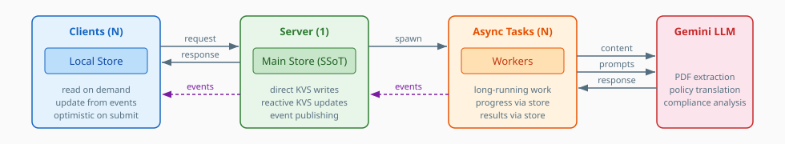

The EC2U PhD Agreements Tool is a **client-server Atlassian Forge application** for drafting cotutelle PhD agreements
within Confluence.

# Topology

The system comprises three component types:

- **N clients**: browser instances viewing the same Confluence page
- **1 server**: stateless Forge resolvers acting as the single source of truth
- **N async tasks**: queue-based workers performing long-running operations

Forge functions are stateless and request-scoped — no long-lived process can hold a subscription.

# Application Layers

## Client Layer

- **Entry Point**: tabbed UI interface rendered as a Confluence macro
- **View Components**: Agreement, Policies, Issues, and Chat interfaces
- **Hooks**: custom React hooks for resource data management
- **Ports**: bridge functions wrapping `invoke()` calls to server resolvers

## Server Layer

- **Ports**: Forge resolver functions implementing resource-centric handlers
- **Store**: event-driven store providing the single source of truth with KVS persistence and event publishing
- **Task Handlers**: policy extraction/translation and compliance analysis
- **Task Dispatcher**: routes queued tasks to the appropriate handler

## Shared Layer

- **Store Model**: `Activity` enum, event types, and type guards shared between client and server
- **Type Definitions**: documents, issues, and languages
- **Utilities**: type checking and text processing functions

## External Systems

- **Key-Value Store (KVS)**: Forge persistent storage for documents, issues, and job state
- **Forge Queue**: async task execution via queue consumer
- **Forge Realtime**: event publishing via `publishGlobal`/`subscribeGlobal`
- **Gemini AI**: document analysis and natural language processing

# Resource-Centric Data Model

The system is organised around two **resource collections**, each scoped to a Confluence page:

- **Policies**: PDF attachments extracted and optionally translated into structured documents
- **Issues**: compliance concerns detected by AI analysis, each with mutable state, severity, and annotations

Both collections share the same two-level structure:

- **Catalogue**: the collection as a whole (list of policies, list of issues)
- **Items**: individual resources within the collection (a single document, a single issue)

Each operation targets a specific resource by identity. Reads, writes, and async triggers all address the same resource
key — two clients requesting the same resource naturally converge on the same state without coordination. This
resource-centric model maps directly to REST semantics (see [Evolution Opportunities](evolution.md) for the target REST
API).

`Status<T>` unifies the possible states of any resource: a value (`T`), an `Activity` (async operation in progress), or
a `Trace` (error). The same `Status<T>` type flows through the server store, client store, events, and UI hooks.

# Event-Driven Store

## Server Store

The server holds the **main store** acting as the single source of truth for the whole system. The server updates KVS
directly when handling requests or completing async tasks, then publishes events to notify all connected clients.

Events carry full updated state so client caches update directly without server roundtrips.

## Client Store

Each client maintains a **local store** kept in sync with the server store through three mechanisms:

- **Read on demand**: cache hit returns the value; cache miss triggers a server action
- **Update from events**: Forge Realtime events carry full state, updating the local cache directly
- **Optimistic on submit**: clients purge local state and optimistically update to the submitting activity

## Client/Server Interaction

All client requests are routed through the store, not sent directly to backend endpoints:

- **Synchronous updates**: server handles the request, writes KVS, and publishes an event to clients
- **Asynchronous actions**: server spawns an async task; the task writes KVS and publishes progress and results to
  clients via the store

See [Interaction Workflows](workflow.md) for the detailed execution flow covering reads, sync updates, async operations,
deduplication, error handling, and stale task recovery.

# Concurrency

Progress is **state-based**: resource state tracks ongoing async operations, so new clients joining mid-operation get a
sensible initial state reporting progress.

**Lockless two-stage deduplication** prevents duplicate job execution without distributed locks. The resolver gate
checks job state before queuing; the worker gate checks on task entry. If both gates are bypassed by a race condition,
idempotent work ensures the duplicate produces an equivalent result.

See [Job Scheduling](scheduling.md) for the full deduplication gate design.
