> [!CAUTION]
> AI-based tools can make mistakes: double check results and use them with caution.

> [!WARNING]
> The system provides a secure working environment, with all documents safely stored within the Confluence platform.
> Data
> is shared only with certified external cloud systems for the duration strictly necessary to complete processing and is
> never disclosed to third parties.
>
> To further enhance privacy, share personally identifiable information only when strictly necessary: draft with
> placeholders and add personal details only when finalizing locally.

> [!WARNING]
> The system is not intended to fully automate processes requiring professional expertise. Think of it as a junior
> assistant: delegate to speed up work, but keep control over decisions.

# Agreements

## Open Agreement Catalogue

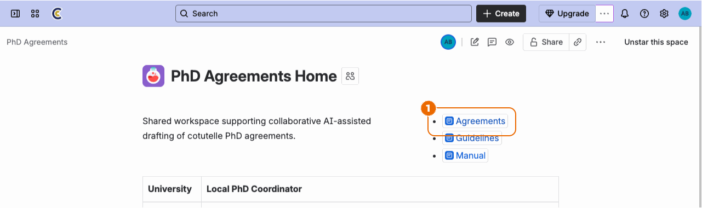

1. Navigate to the catalogue from the workspace main page

## Create New Agreement

1. [Open the agreement catalogue](#open-agreement-catalogue)

   

2. Click on the `Create New Agreement` button

   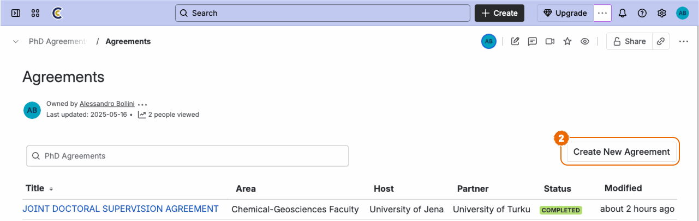

3. Enter agreement metadata

- **Status** / Delete immaterial tags or use the `/status` command to enter new color-coded values
- **Area** / Enter name of the reference faculty/department
- **Host/Partner** / Enter the name of host/partner institutions
- **Contact** / Use `@Mention` to link the profile of the principal editor for the agreement

4. Enter the initial agreement text into the body of the `EC2U PhD Agreement Tool` macro

5. Most Confluence editing tools are available also inside the macro body

6. When done, click on the `Update` button to publish the new agreement

> [!WARNING]
> Be careful to place the agreement text **inside** the `EC2U PhD Agreements Tool` macro body. Removing or overwriting
> the macro would prevent the agent from working.

## Open Agreement

1. [Open the agreement catalogue](#open-agreement-catalogue)

   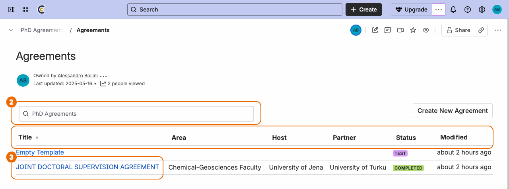

2. Identify the relevant agreement

- Use the search field to filter on the agreement name
- Click on the catalogue field names in the table header to alter sorting

3. Click on the relevant agreement name to open it

## Update Agreement

1. [Open the relevant agreement](#open-agreement)

   

2. Click on the `Edit` button to enter editing model

3. Edit agreement metadata or the text in the body of the `EC2U PhD Agreement Tool` macro

- All Confluence collaborative features are available in editing mode

4. When done, click on the `Update` button to save and publish changes

- The `Close` button will save changes as a draft version without publishing them

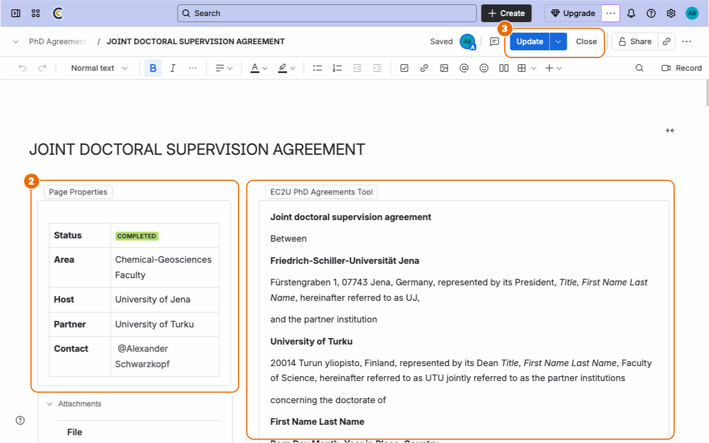

## Delete Agreement

1. [Open the relevant agreement](#open-agreement)

   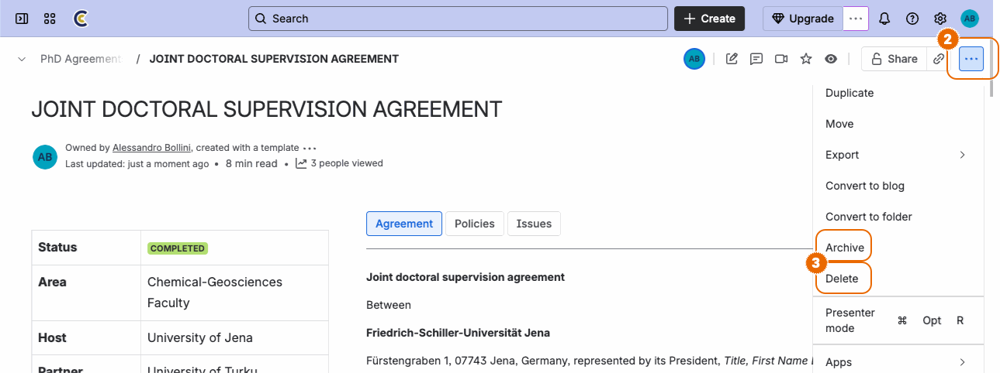

2. Click on the `More actions` button in the top-right corner

3. Click on the `Delete` button in the dropdown menu

- The `Archive` button would move the document to an archival area without permanently deleting it

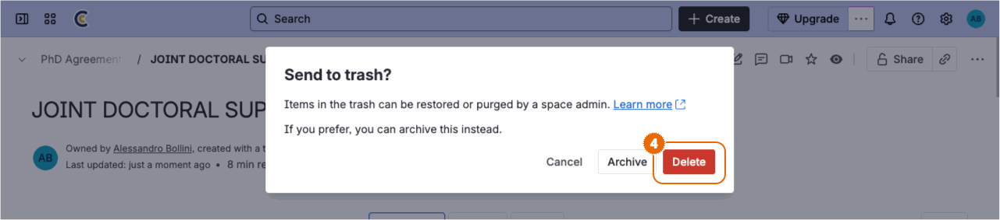

4. Click on the `Delete` button to confirm the operation

# Policies

*Policies* are institutional or regulatory documents that define requirements, guidelines, and standards governing PhD
agreements. These PDF documents are attached to agreements and serve as reference materials during the analysis process,
helping identify potential issues and ensuring compliance with institutional norms. Policies can originate from both
institutions involved in the agreement and may apply at different levels: national, institutional, or area-specific
(for instance, department or faculty).

## Attach Policies to Agreement

1. [Open the target agreement](#open-agreement)

   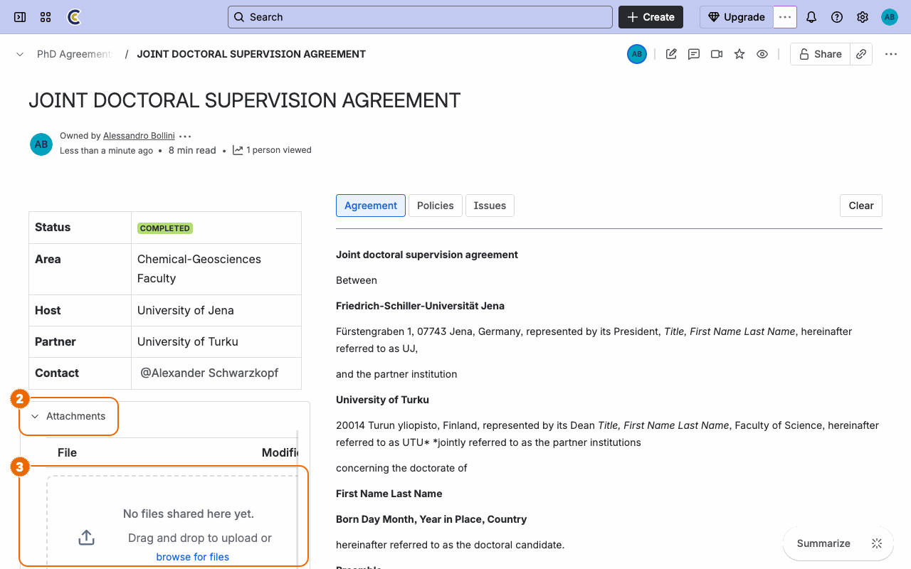

2. Click on the `Attachment` disclosure label to open the attachment catalogue

3. Upload PDF policy documents by clicking on the `browse for files` button other than dragging them to the attachment
   drop area

> [!WARNING]
> Only PDF policy documents will be considered in the agreement [analysis process](#analyse-agreement).

> [!TIP]
> For best results rename the policy documents in order to provide a clear human-readable label: the policy file name
> will be used to reference its content in AI-identified issues.

> [!NOTE]
> The system will automatically translate to English policies written in a local language.

## Detach Policy from Agreement

1. [Open the target agreement](#open-agreement)

   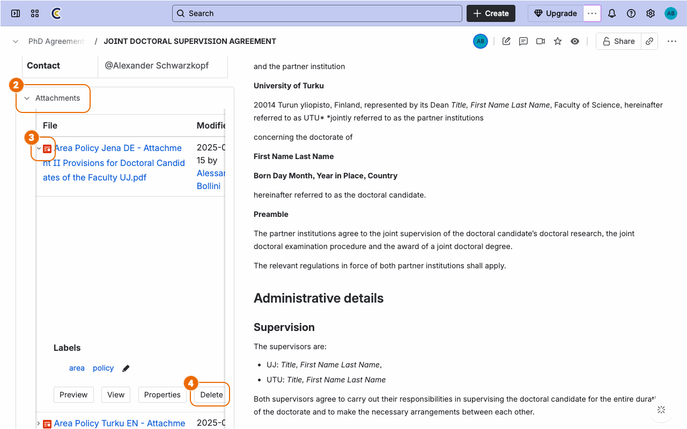

2. Click on the `Attachment` disclosure label to open the attachment catalogue

3. Click on the target attachment disclosure label to open the attachment detail panel

4. Click on the `Delete` button

   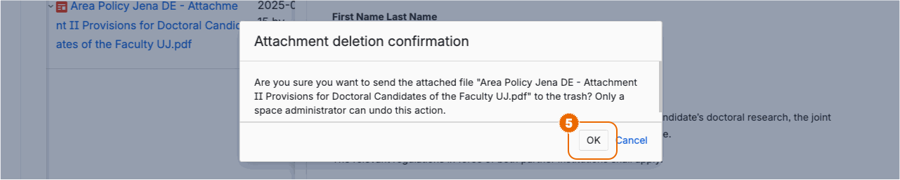

5. Click on the `OK` button to confirm the operation

## Inspect Policy Translation

1. [Open the target agreement](#open-agreement)

2. Click on the `Policies` button to show the policy catalogue

   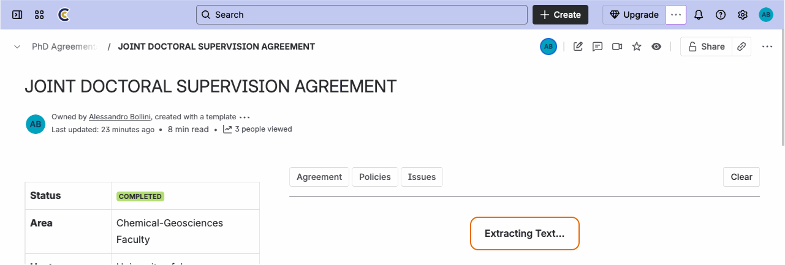

3. Click on a policy link to inspect its English translation

   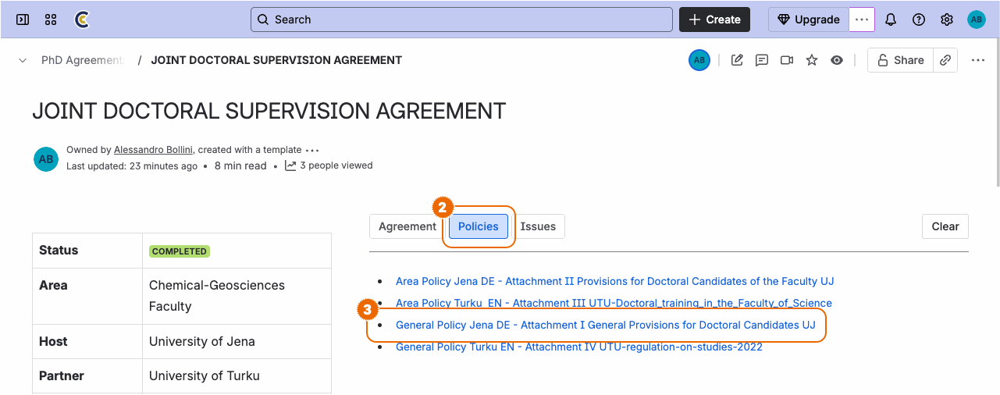

> [!NOTE]
> On first access, the system will spend some minutes extracting the plain text from the original PDF document and
> translating it to English: stand by until the process completes; results will be cached for quicker subsequent access.

## Download Policy

1. [Open the target agreement](#open-agreement)

   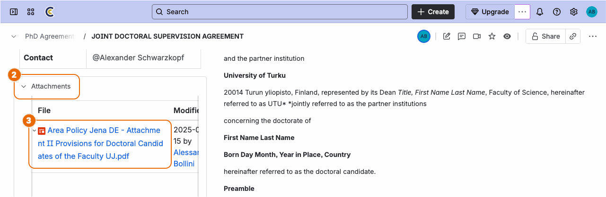

2. Click on the `Attachment` disclosure label to open the attachment catalogue

3. Click on the policy filename to download the original PDF document

# Issues

*Issues* are specific problems, inconsistencies, or points of concern identified when the agreement text is evaluated
against attached [policy](#policies) documents. They help users track, classify, and resolve all matters that may affect
the completeness or compliance of the PhD agreement.

Issues are structured with the following properties:

| Property        | Value        | Description                                                                                                                                                |
|-----------------|--------------|------------------------------------------------------------------------------------------------------------------------------------------------------------|
| **Title**       |              | Describes the specific problem or concern                                                                                                                  |
| **State**       | `Blocked`    | The solution to the issue is blocked by external factors. This means progress cannot continue until these external dependencies or obstacles are resolved. |
|                 | `Active`     | The issue is currently being actively worked on. Team members are engaged in addressing or resolving the issue.                                            |
|                 | `Pending`    | The issue is still awaiting initial triage. No active work has started yet, and it may be waiting for assignment, clarification, or prioritization.        |
|                 | `Resolved`   | The issue has been successfully resolved. All necessary actions have been completed, and no further work is required.                                      |
| **Severity**    | ★★★ (High)   | Issues that are critical and require immediate attention or could significantly impact the agreement or compliance.                                        |
|                 | ★★☆ (Medium) | Issues that are important but not urgent; they should be addressed but do not block progress.                                                              |
|                 | ★☆☆ (Low)    | Minor issues that have little impact and can be resolved at a later stage.                                                                                 |
| **References**  |              | Excerpts from the agreement text and citations from relevant policy documents (expandable/collapsible)                                                     |
| **Annotations** |              | User-added notes supporting Markdown format for tracking decisions and context                                                                             |

## Analyse Agreement

1. [Open the target agreement](#open-agreement)

2. Click on the `Issues` button to show the issue catalogue

   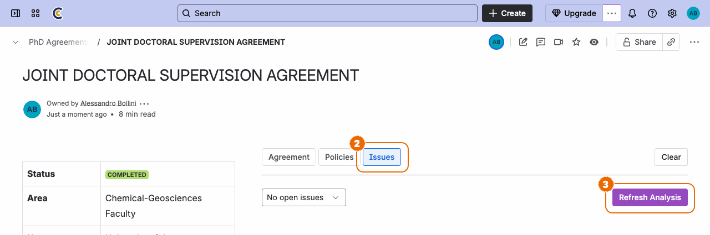

3. Click on the `Refresh Analysis` button

   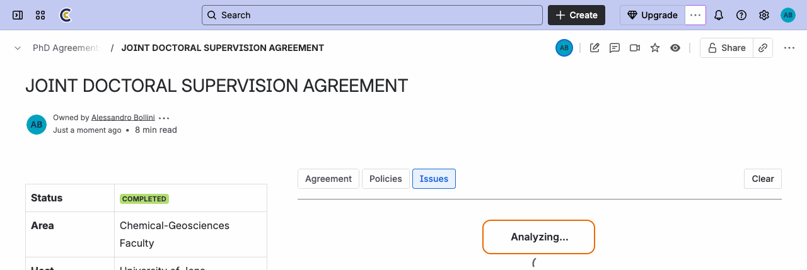

> [!NOTE]
> The system will spend some minutes evaluating the agreement text against each attached policy document: stand by until
> the process completes; results will be cached for quicker subsequent access.

> [!NOTE]
> Agreement analysis may be refreshed at any time, especially after the agreement text is modified; the system will take
> into account existing issues and focus only on changes.

## Inspect Issues

1. [Open the target agreement](#open-agreement)

2. Click on the `Issues` button to show the issue catalogue

3. Click on the `State` or `Severity` dropdowns and select the relevant value to filter catalogue

   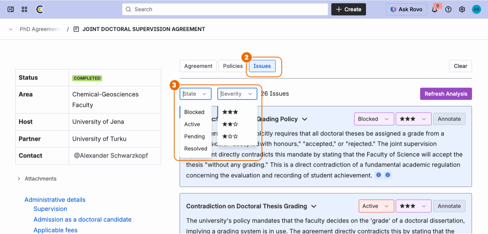

4. Click on the `Clear` buttons to remove filtering

   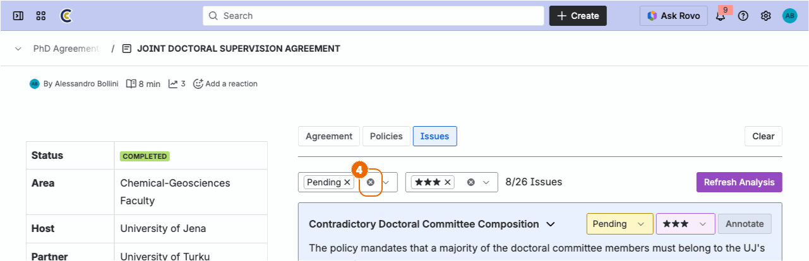

## Inspect References

1. [Open the target agreement](#open-agreement)

   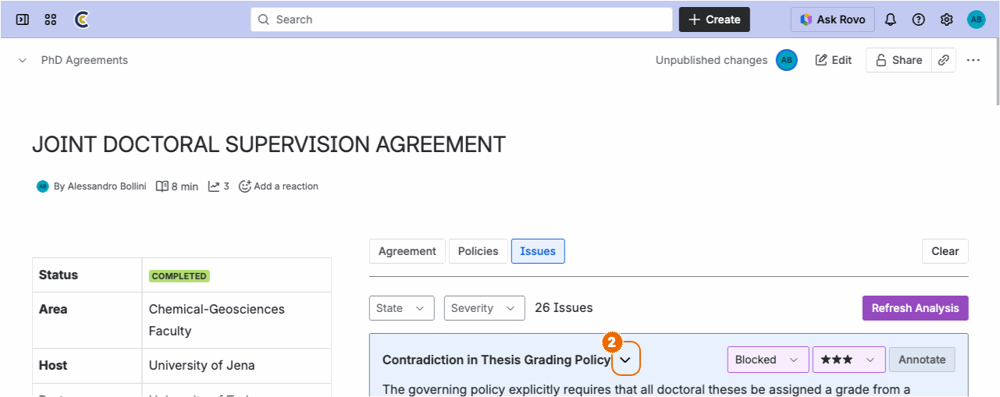

2. Click on the disclosure button next to the issue title to toggle issue references

   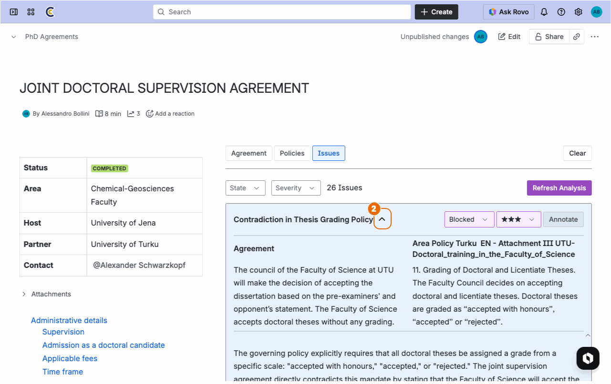

## Transition Issue

1. [Inspect issues](#inspect-issues) and scroll to the relevant issue

   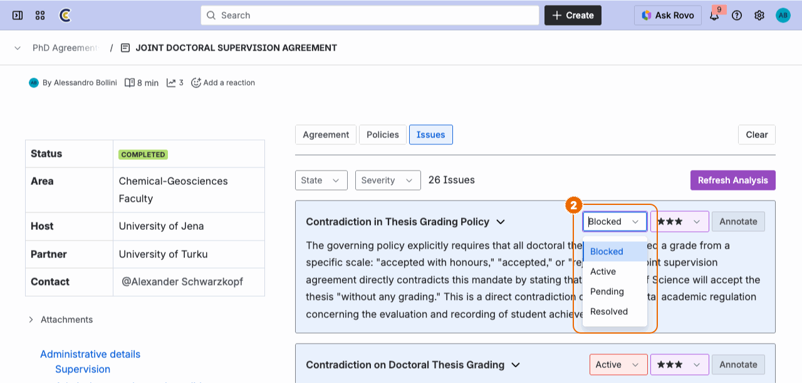

2. Click on the issue state dropdown and select the relevant state classification to override the value automatically
   assigned by the system on creation (see [issue structure](#issues) for available values)

## Classify Issue

1. [Inspect issues](#inspect-issues) and scroll to the relevant issue

   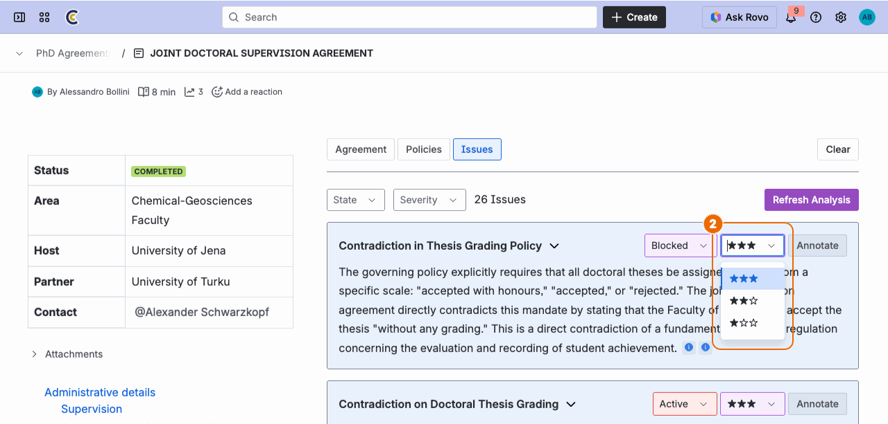

2. Click on the issue severity dropdown and select the relevant severity classification to override the value
   automatically assigned by the system on creation (see [issue structure](#issues) for available values)

## Annotate Issue

1. [Inspect issues](#inspect-issues) and scroll to the relevant issue

   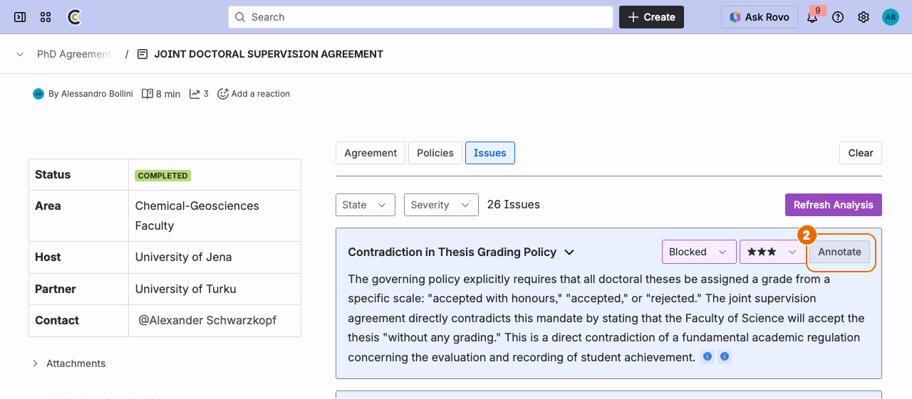

2. Click on the `Annotate` button to enter annotation mode

   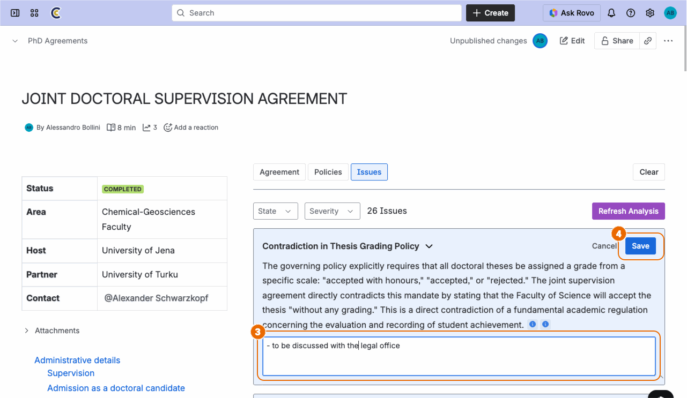

3. Enter or edit issue annotations

4. Click on the `Save` button to save updated annotations

> [!TIP]
> Structured annotations may be entered using the basic [Markdown](https://www.markdownguide.org/) format.

> [!NOTE]
> The system will take into account annotations when [refreshing agreement analysis](#analyse-agreement).

# Cache

## Clear Cached Results

1. [Open the target agreement](#open-agreement)

   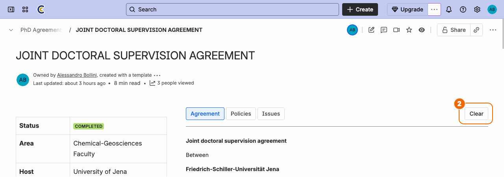

2. Click on the `Clear` button

   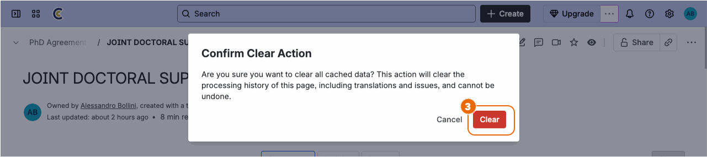

3. Click on the `Clear` button to confirm the operation
