> [!WARNING]
> [AI-based tools can make mistakes](../ai-usage.md): double check results and use them with caution.

The system provides a secure working environment, with all documents safely stored within the Confluence platform. Data
is shared only with certified external cloud systems for the duration strictly necessary to complete processing and is
never disclosed to third parties.

To further enhance privacy, share personally identifiable information only when strictly necessary: draft with
placeholders and add personal details only when finalising locally.

The system is not intended to fully automate processes requiring professional expertise. Think of it as a junior
assistant: delegate to speed up work, but keep control over decisions.

# Agreements

## Open Agreement Catalogue

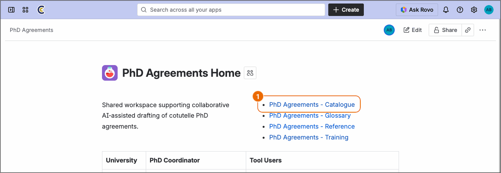

1. Navigate to the catalogue from the workspace main page

## Create New Agreement

1. [Open the agreement catalogue](#open-agreement-catalogue)

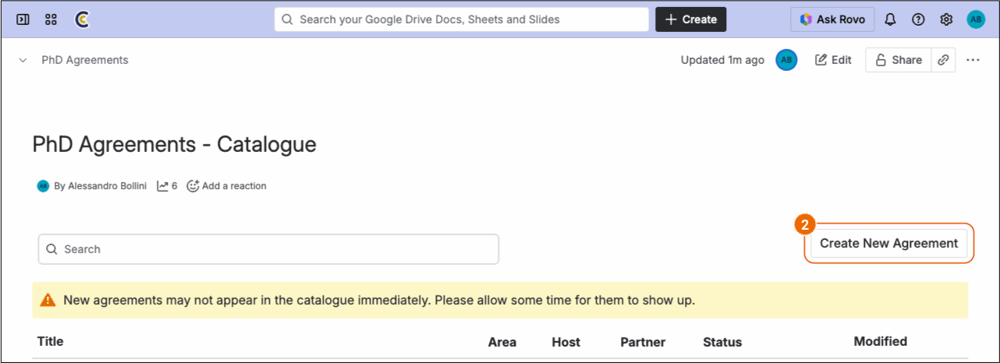

2. Click on the `Create New Agreement` button

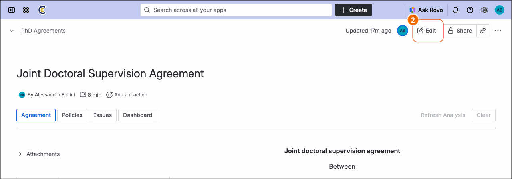

3. Enter agreement title
4. Enter agreement metadata

   - **Status** - Delete immaterial tags or use the `/status` command to enter new colour-coded values
   - **Area** - Enter name of the reference faculty/department
   - **Host/Partner** - Enter the name of host/partner institutions
   - **Contact** - Use `@Mention` to link the profile of the principal editor for the agreement

5. Replace the placeholder with the initial agreement text

> [!IMPORTANT]
> Be careful not to remove the `EC2U PhD Agreements Tool` macro or to alter the overall document structure in other
> ways. Removing or overwriting the macro or altering the document structure would prevent the agent from working.

6. All Confluence editing tools may be used to structure and format the agreement text
7. When done, click on the `Update` button to publish the new agreement

## Open Agreement

1. [Open the agreement catalogue](#open-agreement-catalogue)

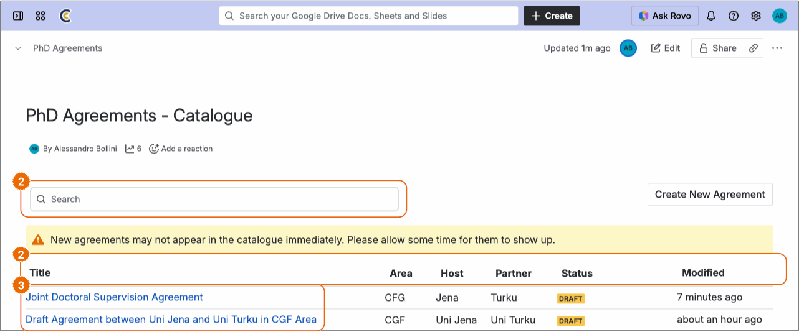

2. Identify the relevant agreement

   - Use the search field to filter on the agreement name
   - Click on the catalogue field names in the table header to alter sorting

3. Click on the relevant agreement name to open it

## Update Agreement

1. [Open the relevant agreement](#open-agreement)

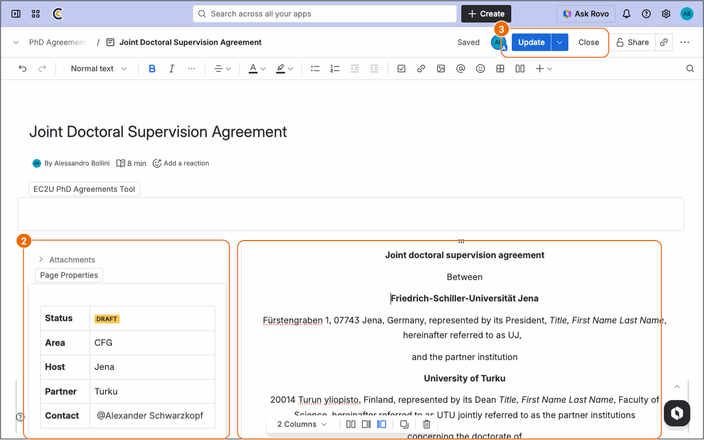

2. Click on the `Edit` button to enter editing mode

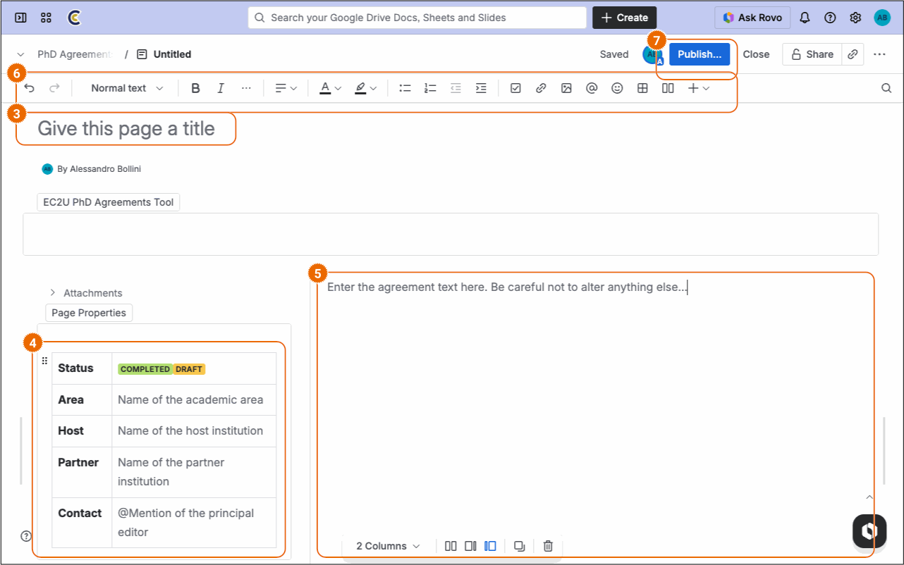

3. Edit agreement metadata or the agreement text

   - All Confluence collaborative features are available in editing mode

4. When done, click on the `Update` button to save and publish changes

   - The `Close` button will save changes as a draft version without publishing them

## Delete Agreement

1. [Open the relevant agreement](#open-agreement)

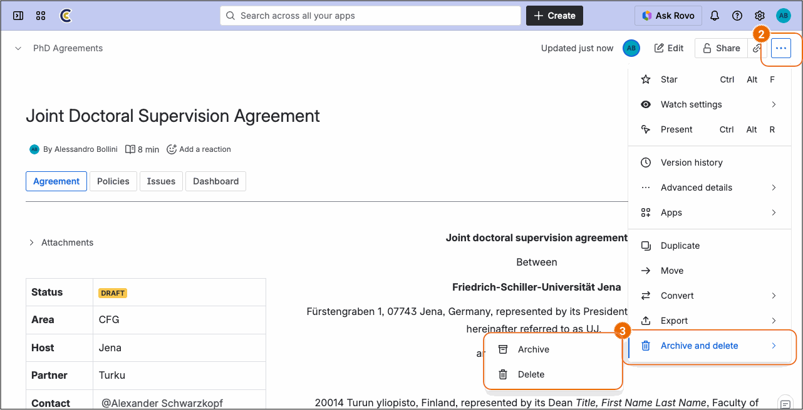

2. Click on the `More actions` button in the top-right corner
3. Click on the `Archive and Delete` button in the dropdown menu and select an action

   - `Archive` would move the document to an archival area without permanently deleting it
   - `Delete` would immediately move the document to the trash

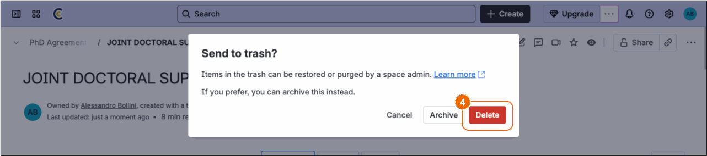

4. Click either on the `Delete` or `Archive` button to confirm the operation

# Policies

*Policies* are institutional or regulatory documents that define requirements, guidelines, and standards governing PhD
agreements. These PDF documents are attached to agreements and serve as reference materials during the analysis process,
helping identify potential issues and ensuring compliance with institutional norms. Policies can originate from both
institutions involved in the agreement and may apply at different levels: national, institutional, or area-specific (for
instance, department or faculty).

## Attach Policies to Agreement

1. [Open the target agreement](#open-agreement)

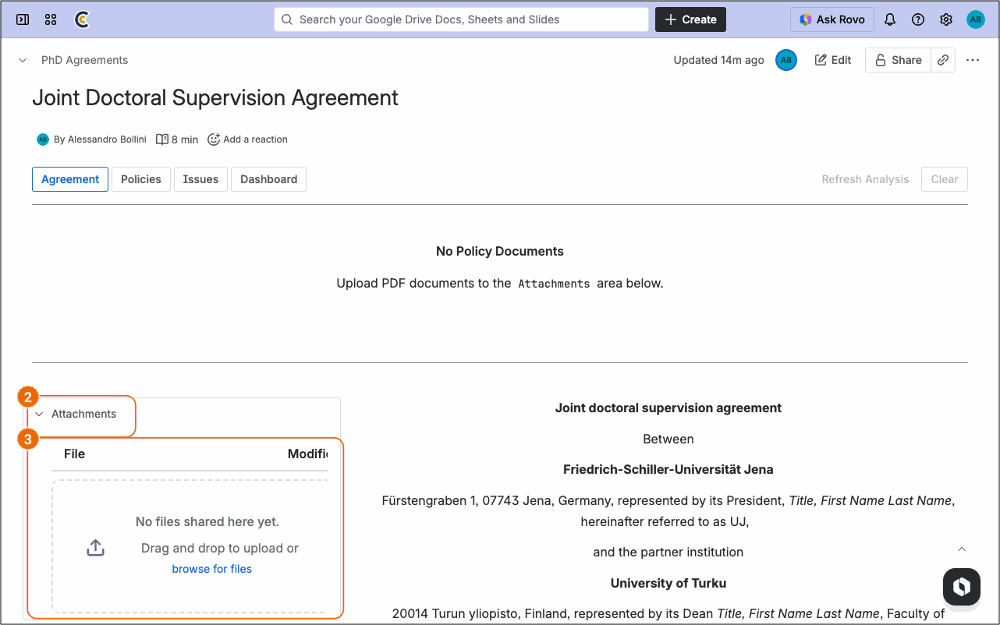

2. Click on the `Attachment` disclosure label to open the attachment catalogue
3. Upload PDF policy documents by clicking on the `browse for files` button or by dragging them to the attachment drop
   area

> [!NOTE]
> Only PDF policy documents will be considered in the agreement [analysis process](#analyse-agreement).

For best results rename the policy documents in order to provide a clear human-readable label: the policy file name will
be used to reference its content in AI-identified issues.

The system will automatically translate to English policies written in a local language.

## Detach Policy from Agreement

1. [Open the target agreement](#open-agreement)

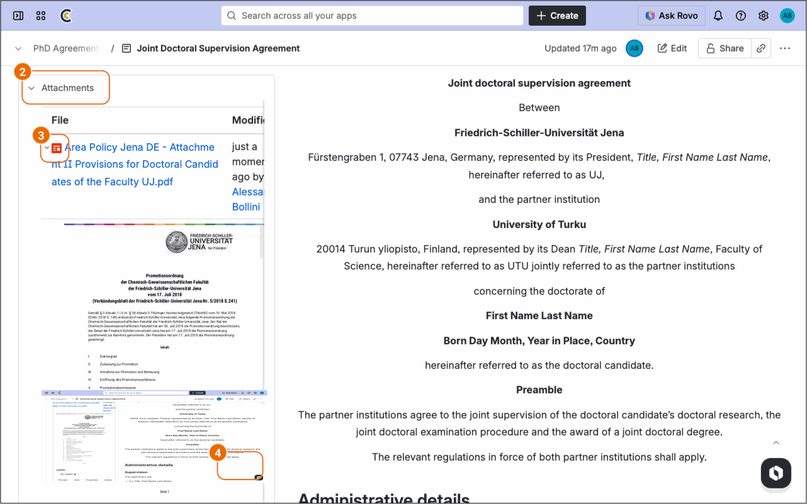

2. Click on the `Attachment` disclosure label to open the attachment catalogue
3. Click on the target attachment disclosure label to open the attachment detail panel
4. Click on the `Delete` button

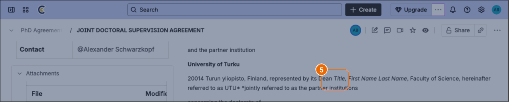

5. Click on the `OK` button to confirm the operation

## Inspect Policy Translation

1. [Open the target agreement](#open-agreement)

2. Click on the `Policies` button to show the policy catalogue
3. Click on a policy title to inspect its English translation

On first access, the system will spend some minutes extracting the plain text from the original PDF document and
translating it to English: stand by until the process completes; results will be cached for quicker subsequent access.

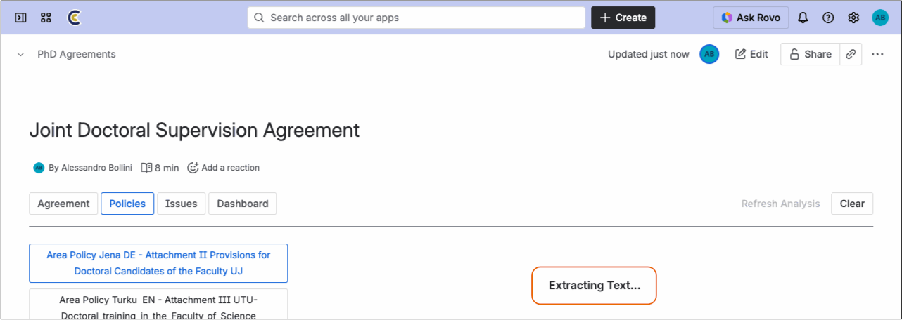

## Download Policy

1. [Open the target agreement](#open-agreement)

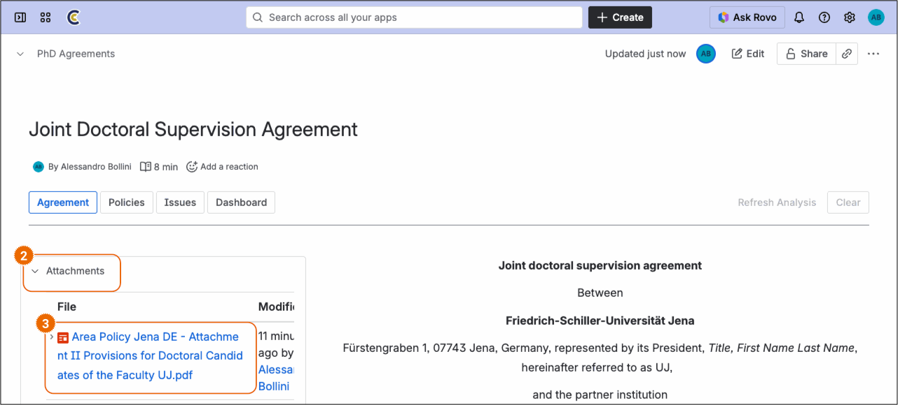

2. Click on the `Attachment` disclosure label to open the attachment catalogue
3. Click on the policy filename to download the original PDF document

# Issues

Issues are specific problems, inconsistencies, or points of concern identified when the agreement text is evaluated
against attached policy documents. They help users track, classify, and resolve all matters that may affect the
completeness or compliance of the PhD agreement.

Issues are structured with the following properties:

| Property | Value | Description |
|---|---|---|
| **Title** | | Describes the specific problem or concern |
| **State** | `Blocked` | The solution to the issue is blocked by external factors |
| | `Active` | The issue is currently being actively worked on |
| | `Pending` | The issue is still awaiting initial triage |
| | `Resolved` | The issue has been successfully resolved |
| **Severity** | ★★★ (High) | Critical issues requiring immediate attention |
| | ★★☆ (Medium) | Important but not urgent issues |
| | ★☆☆ (Low) | Minor issues with little impact |
| **References** | | Excerpts from the agreement text and citations from relevant policy documents (expandable/collapsible) |
| **Annotations** | | User-added notes supporting Markdown format for tracking decisions and context |

## Analyse Agreement

1. [Open the target agreement](#open-agreement)

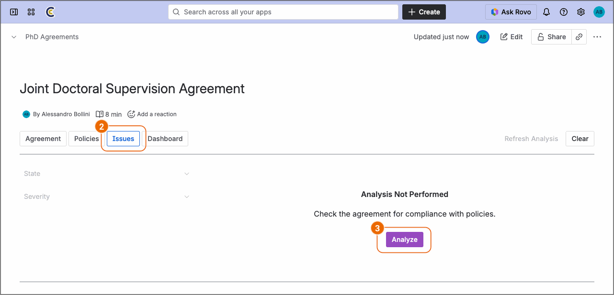

2. Click on the `Issues` button to show the issue catalogue
3. Click on the `Refresh Analysis` button

The system will spend some minutes evaluating the agreement text against each attached policy document: stand by until
the process completes; results will be cached for quicker subsequent access.

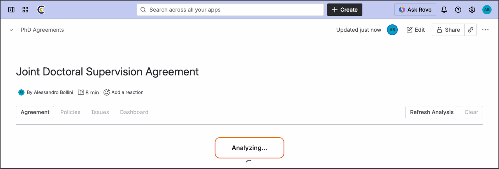

Agreement analysis may be refreshed at any time, especially after the agreement text is modified; the system will take
into account existing issues and focus only on changes.

## Inspect Issues

1. [Open the target agreement](#open-agreement)

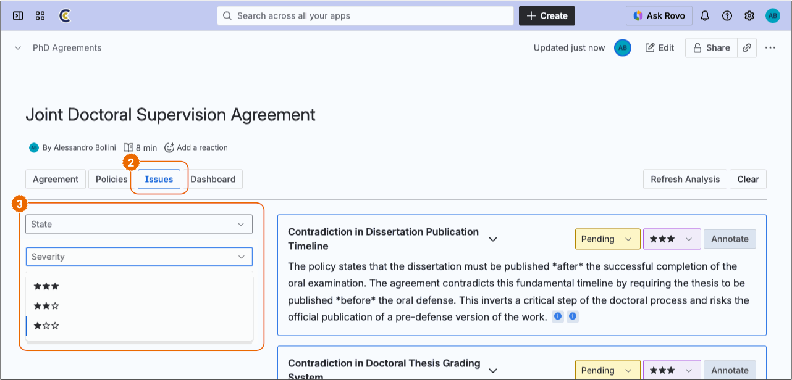

2. Click on the `Issues` button to show the issue catalogue
3. Click on the `State` or `Severity` dropdowns and select the relevant value to filter catalogue

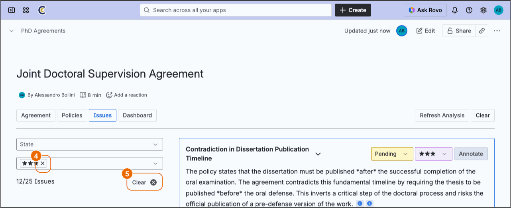

4. Click on an `X` button to remove a specific constraint
5. Click on the `Clear` buttons to remove all constraints

## Inspect References

1. [Open the target agreement](#open-agreement)

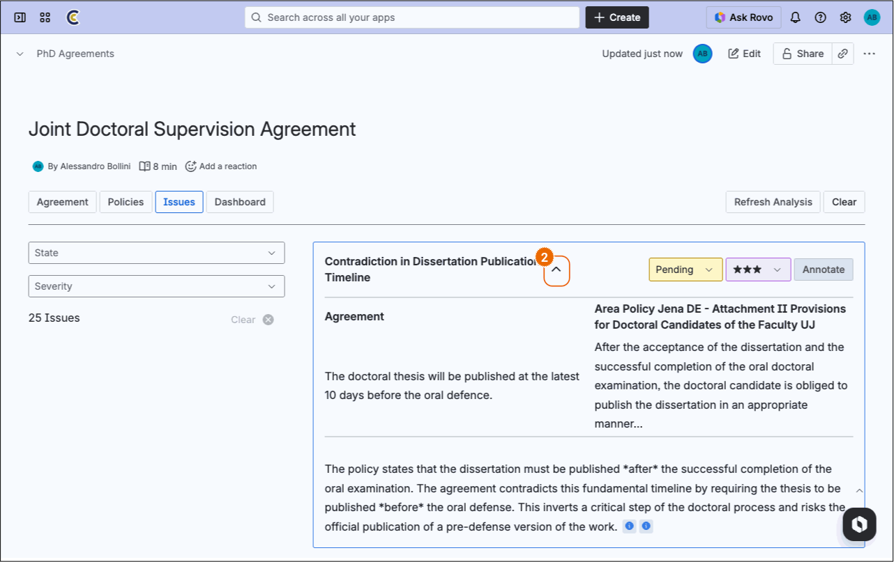

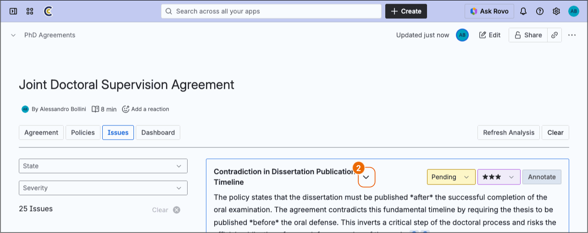

2. Click on the disclosure button next to the issue title to toggle issue references

## Transition Issue

1. [Inspect issues](#inspect-issues) and scroll to the relevant issue

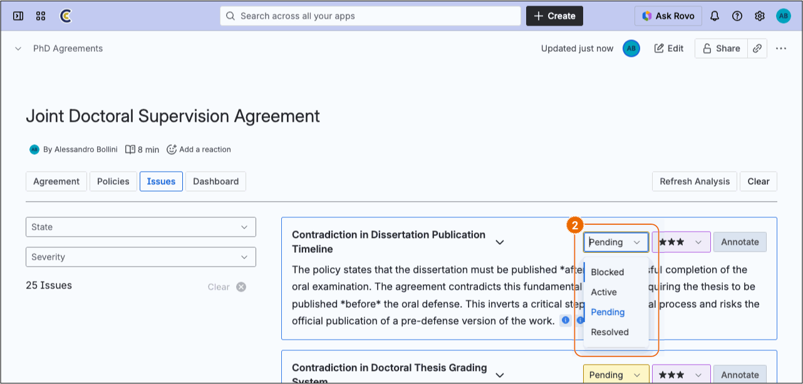

2. Click on the issue state dropdown and select the relevant state classification to override the
   [value](#issues) automatically assigned by the system on creation

## Classify Issue

1. [Inspect issues](#inspect-issues) and scroll to the relevant issue

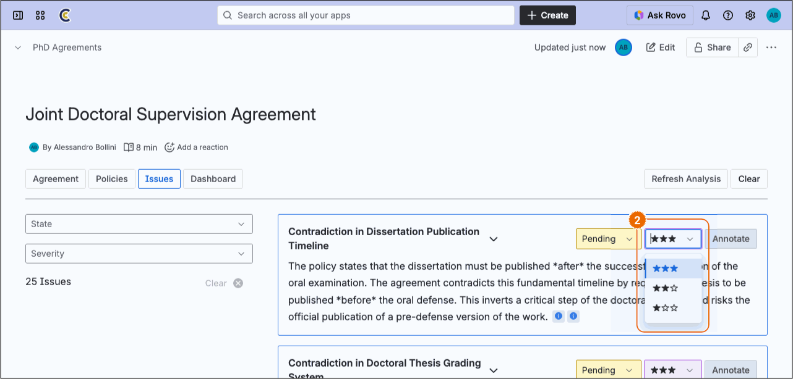

2. Click on the issue severity dropdown and select the relevant severity classification to override the
   [value](#issues) automatically assigned by the system on creation

## Annotate Issue

1. [Inspect issues](#inspect-issues) and scroll to the relevant issue

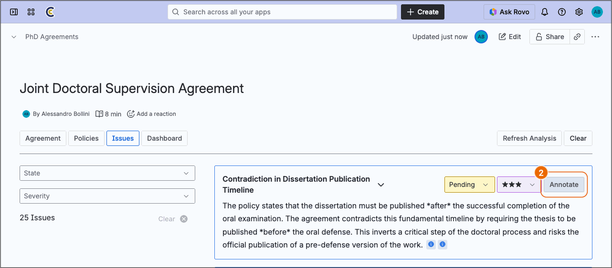

2. Click on the `Annotate` button to enter annotation mode

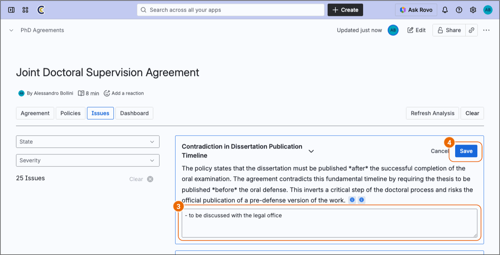

3. Enter or edit issue annotations
4. Click on the `Save` button to save updated annotations

Structured annotations may be entered using the basic [Markdown](https://www.markdownguide.org/basic-syntax/) format.

The system will take into account annotations when [refreshing agreement analysis](#analyse-agreement).

# Dashboard

The dashboard view provides a dynamic issue matrix, suitable for status overview and process management:

- Columns represent issue [state](#issues) values
- Rows represent issue [severity](#issues) values
- Cells contain issues with the corresponding state/severity values

## Inspect Issue Matrix

1. [Open the target agreement](#open-agreement)

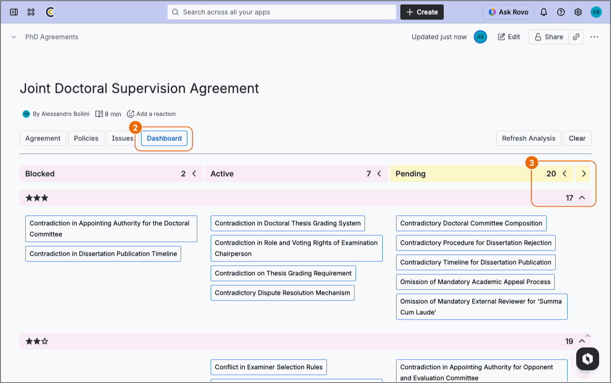

2. Click on the `Dashboard` button to show the issue matrix
3. Click on column/row disclosure buttons to toggle visibility of related content

## Inspect Issue Details

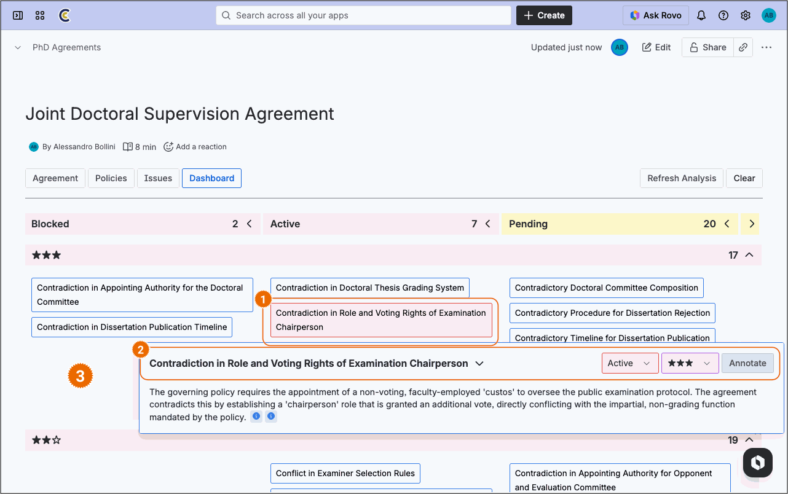

1. Click on an issue title to open its detail panel
2. Interact with the issue using the same tools described in the context of the [issue catalogue](#issues)
3. Click anywhere outside the issue detail panel to close it

Updates to the issue [state](#transition-issue) or [severity](#classify-issue) will dynamically reposition it within
the matrix.

# Cache

## Refresh Analysis

This action is intended to refresh issues after **incremental updates** to the agreement text or attached policy
documents: existing issues and user annotations are taken into account in the process, in order to avoid duplications or
regressions. After **major updates** extensively altering either the structure or the content of the agreement text or
the attached policies you may want to [clear the cache](#clear-cached-results) and
[analyse](#analyse-agreement) the text from scratch.

1. [Open the target agreement](#open-agreement)

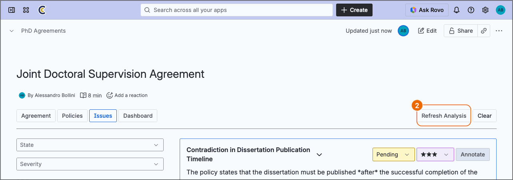

2. Click on the `Refresh Analysis` button

The system will spend some minutes evaluating the agreement text against each attached policy document: stand by until
the process completes; results will be cached for quicker subsequent access.

## Clear Cached Results

Clearing the cache drops the processing history of the page, including
[translations](#inspect-policy-translation) and [issues](#analyse-agreement): the system will recompute required
resources from scratch on demand.

1. [Open the target agreement](#open-agreement)

2. Click on the `Clear` button

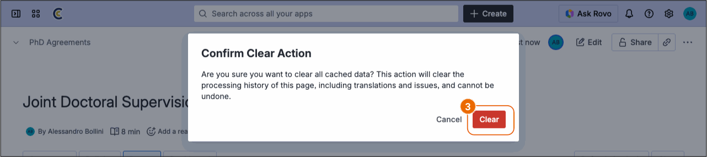

3. Click on the `Clear` button to confirm the operation
