The **EC2U PhD Agreements Tool** helps draft cotutelle PhD agreements using an AI‑based approach to compare agreement
text against institutional policy documents and identify potential compliance issues. It supports local PhD coordinators
and other stakeholders in managing agreement drafts, attaching and translating institutional policy documents, running
automated compliance analyses, and tracking identified issues through resolution.

The system is not intended to fully automate processes requiring professional expertise: think of it as a junior
assistant you can delegate to in order to speed up work, but keeping control over decisions.

> [!IMPORTANT]
> [AI-based tools can make mistakes](../ai-usage.md): double check results and use them with caution.

The tool runs as a Confluence macro: agreements are authored and stored directly within a Confluence workspace, sharing
documents and data with certified external cloud systems only for the duration strictly necessary to complete
processing.

> [!IMPORTANT]
> To further enhance privacy, share personally identifiable information only when strictly necessary: draft with
> placeholders and add personal details only when finalising locally.

# Agreements

## Open Agreement Catalogue

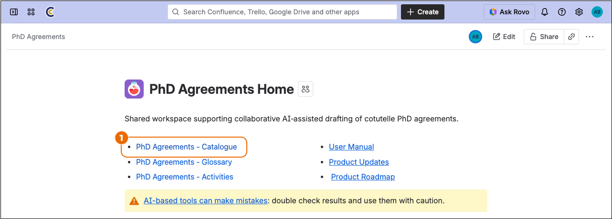

1. Navigate to the catalogue from the workspace main page

## Create New Agreement

1. [Open the agreement catalogue](#open-agreement-catalogue)

	 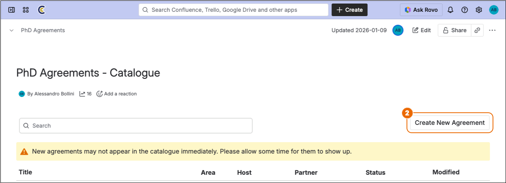

2. Click on the `Create New Agreement` button

	 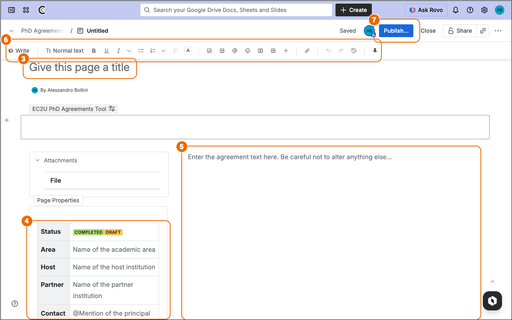

3. Enter agreement title

4. Enter agreement metadata

	- **Status** - Delete immaterial tags or use the `/status` command to enter new colour-coded values
	- **Area** - Enter name of the reference faculty/department
	- **Host/Partner** - Enter the name of host/partner institutions
	- **Contact** - Use `@Mention` to link the profile of the principal editor for the agreement

5. Replace the placeholder with the initial agreement text

	 > [!IMPORTANT]
	 > Be careful not to remove the `EC2U PhD Agreements Tool` macro or to alter the overall document structure in other
	 > ways. Removing or overwriting the macro or altering the document structure would prevent the agent from working.

6. All Confluence editing tools may be used to structure and format the agreement text

7. When done, click on the `Update` button to publish the new agreement

## Open Agreement

1. [Open the agreement catalogue](#open-agreement-catalogue)

	 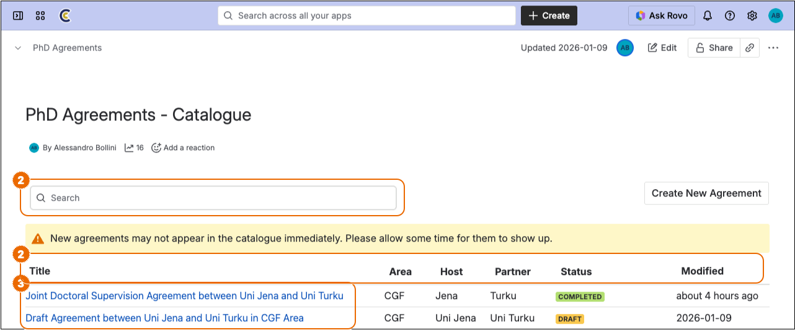

2. Identify the relevant agreement

	- Use the search field to filter on the agreement name
	- Click on the catalogue field names in the table header to alter sorting

3. Click on the relevant agreement name to open it

## Update Agreement

1. [Open the relevant agreement](#open-agreement)

	 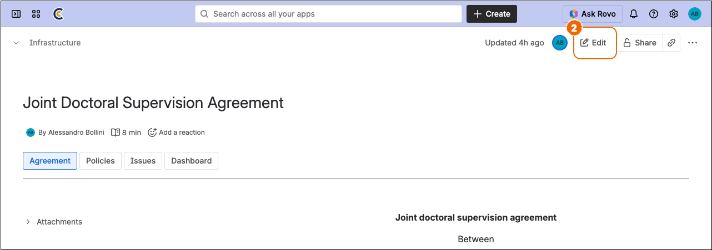

2. Click on the `Edit` button to enter editing mode

	 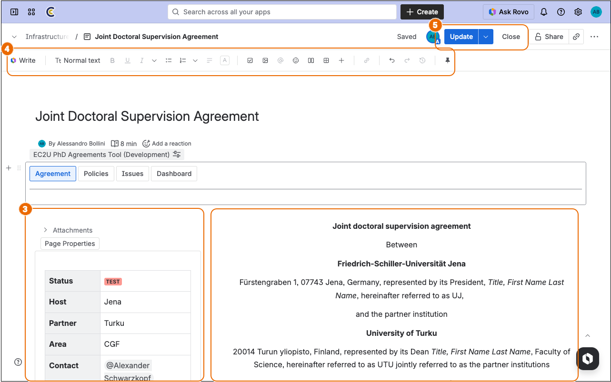

3. Edit agreement metadata or the agreement text

4. All Confluence collaborative features are available in editing mode

5. When done, click on the `Update` button to save and publish changes

	- The `Close` button will save changes as a draft version without publishing them

## Delete Agreement

1. [Open the relevant agreement](#open-agreement)

	 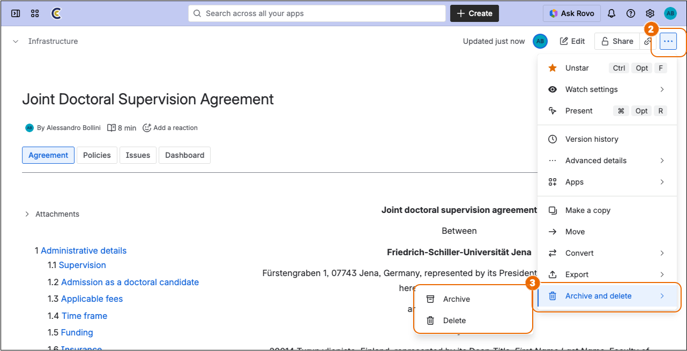

2. Click on the `More actions` button in the top-right corner

3. Click on the `Archive and Delete` button in the dropdown menu and select an action

	- `Archive` would move the document to an archival area without permanently deleting it
	- `Delete` would immediately move the document to the trash

	 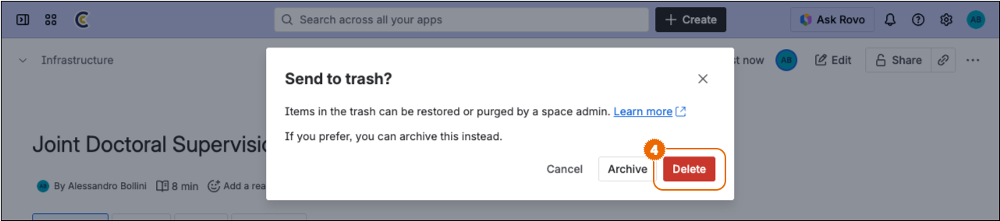

4. Click either on the `Delete` or `Archive` button to confirm the operation

# Policies

*Policies* are institutional or regulatory documents that define requirements, guidelines, and standards governing PhD
agreements. These PDF documents are attached to agreements and serve as reference materials during the analysis process,
helping identify potential issues and ensuring compliance with institutional norms. Policies can originate from both
institutions involved in the agreement and may apply at different levels: national, institutional, or area-specific (for
instance, department or faculty).

## Attach Policies to Agreement

1. [Open the target agreement](#open-agreement)

	 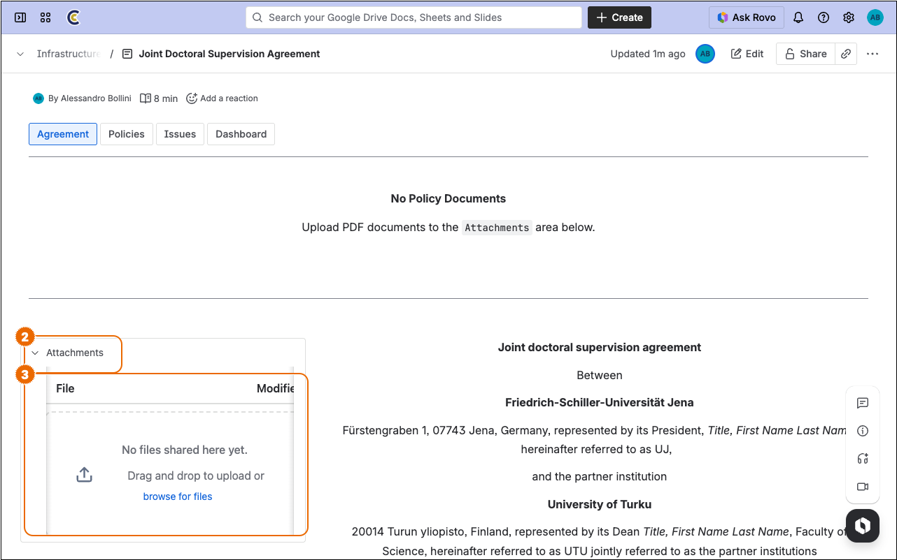

2. Click on the `Attachment` disclosure label to open the attachment catalogue

3. Upload PDF policy documents by clicking on the `browse for files` button or by dragging them to the attachment drop
	 area

> [!NOTE]
> Only PDF policy documents will be considered in the agreement [analysis process](#analyse-agreement).

For best results rename the policy documents in order to provide a clear human-readable label: the policy file name will
be used to reference its content in AI-identified issues.

The system will automatically translate to English policies written in a local language.

## Detach Policy from Agreement

1. [Open the target agreement](#open-agreement)

	 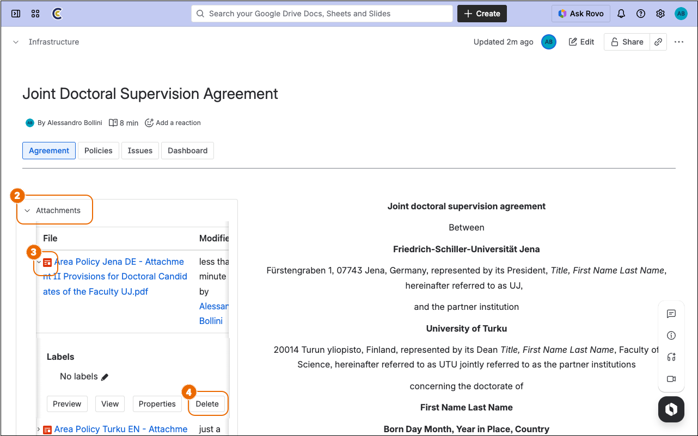

2. Click on the `Attachment` disclosure label to open the attachment catalogue

3. Click on the target attachment disclosure label to open the attachment detail panel

4. Click on the `Delete` button

	 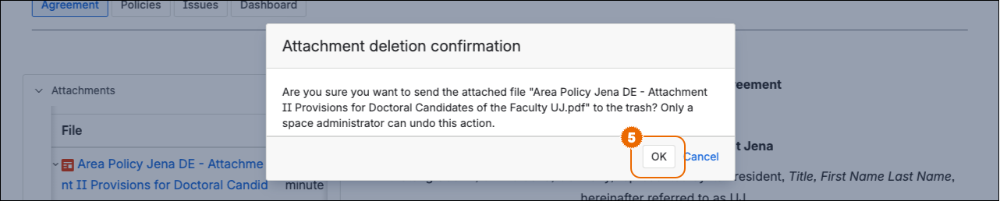

5. Click on the `OK` button to confirm the operation

## Browse Policies

1. [Open the target agreement](#open-agreement)

	 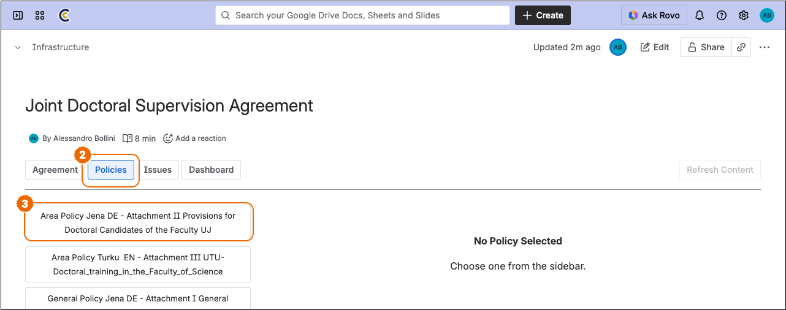

2. Click on the `Policies` tab to show the policy browser; the main area displays the translated content of the selected
	 policy. The sidebar shows a table of contents below the policy list, allowing quick navigation within the document

3. Click on a policy title in the sidebar to inspect its English translation

> [!WARNING]
> On first access, the system will spend some minutes extracting the plain text from the original PDF document and
> translating it to English: stand by until the process completes; results will be cached for quicker subsequent access.

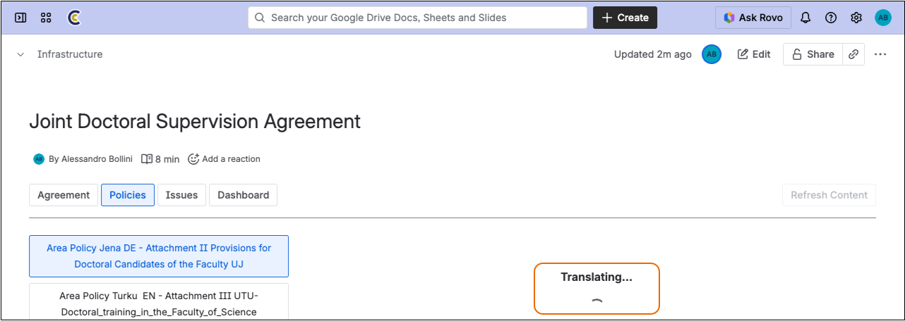

## Refresh Policy Content

1. [Browse policies](#browse-policies) and select the target policy

	 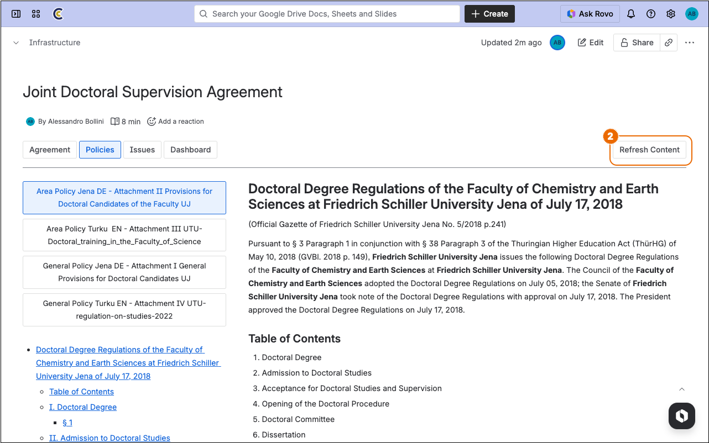

2. Click on the `Refresh Content` button in the toolbar

	 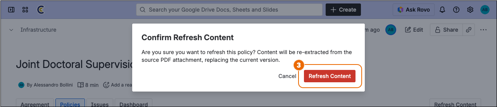

3. Click on the `Refresh Content` button to confirm the operation; the policy content will be re-extracted from the
	 source PDF attachment, replacing the current cached version.

## Download Policy

1. [Open the target agreement](#open-agreement)

	 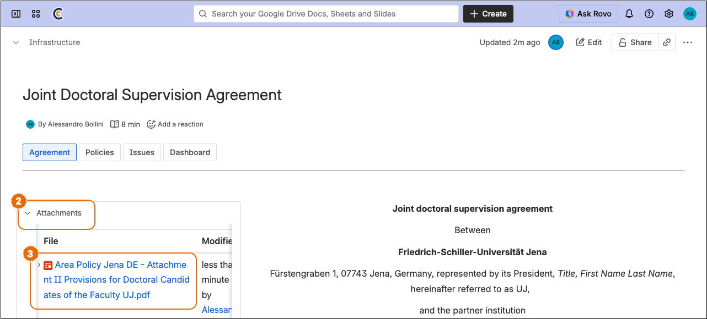

2. Click on the `Attachment` disclosure label to open the attachment catalogue

3. Click on the policy filename to download the original PDF document

# Issues

Issues are specific problems, inconsistencies, or points of concern identified when the agreement text is evaluated
against attached policy documents. They help users track, classify, and resolve all matters that may affect the
completeness or compliance of the PhD agreement.

Issues are structured with the following properties:

| Property        | Value      | Description                                                                                            |
|-----------------|------------|--------------------------------------------------------------------------------------------------------|
| **Title**       |            | Describes the specific problem or concern                                                              |
| **Severity**    | ★★★        | **High** — Critical issues requiring immediate attention                                               |
|                 | ★★☆        | **Medium** — Important but not urgent issues                                                           |
|                 | ★☆☆        | **Low** — Minor issues with little impact                                                              |
| **State**       | `Pending`  | The issue is still awaiting initial triage                                                             |
|                 | `Active`   | The issue is currently being actively worked on                                                        |
|                 | `Blocked`  | The solution to the issue is blocked by external factors                                               |
|                 | `Resolved` | The issue has been successfully resolved                                                               |
| **References**  |            | Excerpts from the agreement text and citations from relevant policy documents (expandable/collapsible) |
| **Annotations** |            | User-added notes supporting Markdown format for tracking decisions and context                         |

## Analyse Agreement

1. [Open the target agreement](#open-agreement)

	 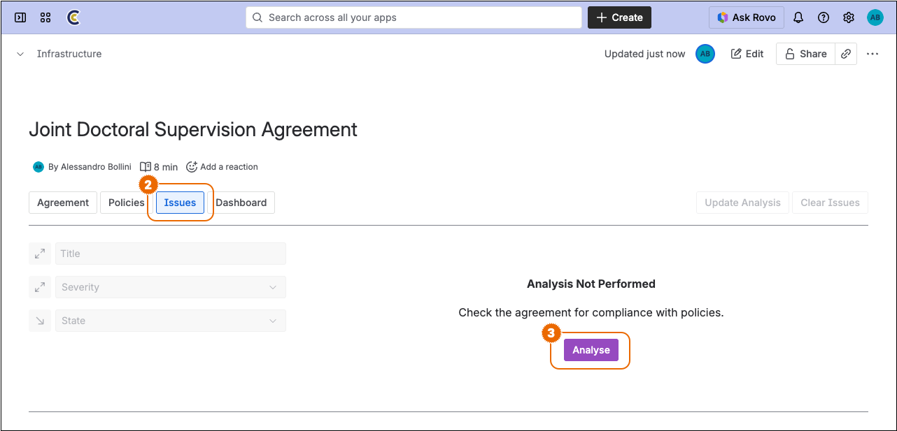

2. Click on the `Issues` tab to show the issue catalogue

3. Click on the `Analyse` button to start the compliance analysis

> [!WARNING]
> The system will spend some minutes evaluating the agreement text against each attached policy document: stand by until
> the process completes; results will be cached for quicker subsequent access.

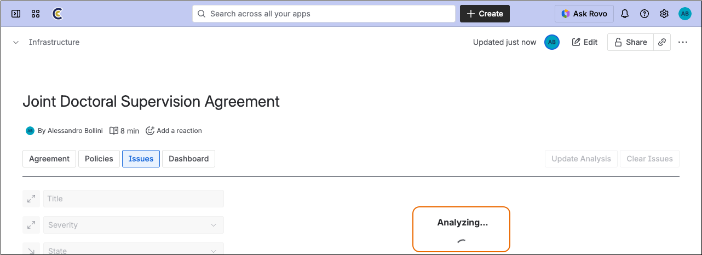

## Inspect Issues

1. [Open the target agreement](#open-agreement)

	 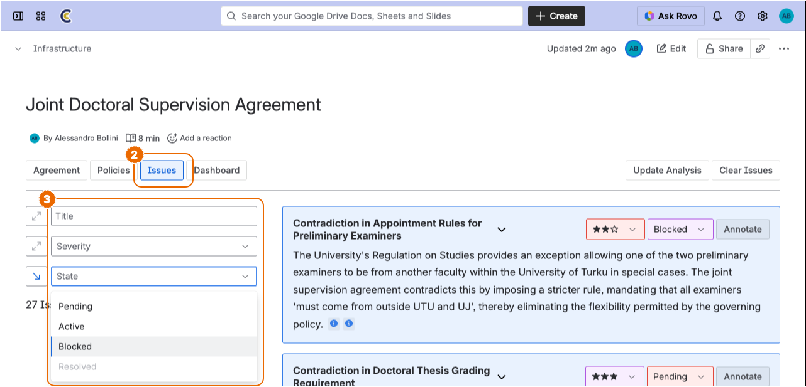

2. Click on the `Issues` tab to show the issue catalogue

3. Use the sidebar controls to search and filter issues:

	- **Title** - Type in the text field to search issues by title keywords
	- **Severity** - Select one or more severity levels to filter the catalogue
	- **State** - Select one or more states to filter the catalogue

		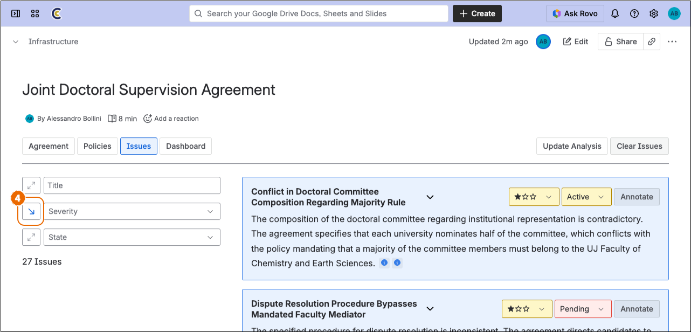

4. Click on the sort toggle next to each field label to cycle through ascending and descending sort order

	 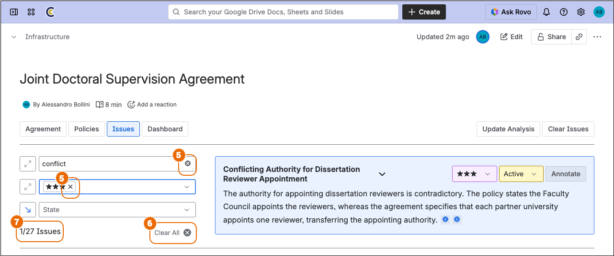

5. Click on the `x` button next to individual filter chips to clear them separately

6. Click on the `Clear All` button at the bottom of the sidebar to remove all filters

7. The issue count at the bottom of the sidebar shows the number of matching issues out of the total.

## Inspect References

1. [Inspect issues](#inspect-issues) and scroll to the relevant issue

	 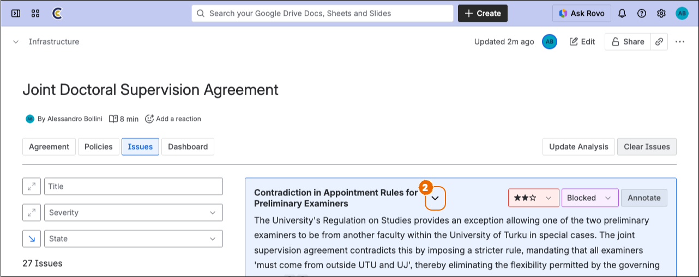

	 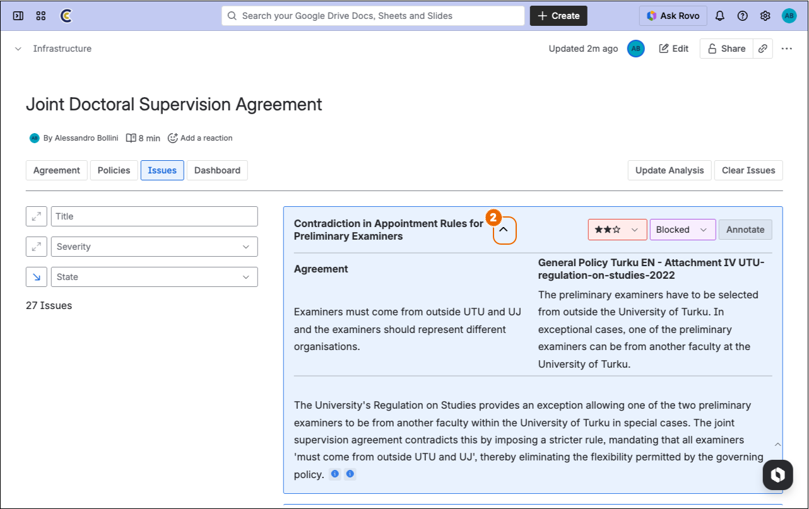

2. Click on the chevron toggle next to the issue title to expand or collapse the reference excerpts

References are displayed in a two-column table comparing agreement text excerpts with relevant policy citations. Inline
reference markers in the issue description can also be clicked to view individual source details in a popup.

## Classify Issue

1. [Inspect issues](#inspect-issues) and scroll to the relevant issue

	 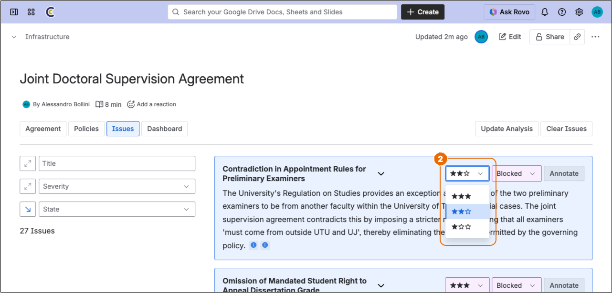

2. Click on the severity selector in the issue header and choose the relevant severity classification to override the
	 [value](#issues) automatically assigned by the system on creation

## Transition Issue

1. [Inspect issues](#inspect-issues) and scroll to the relevant issue

	 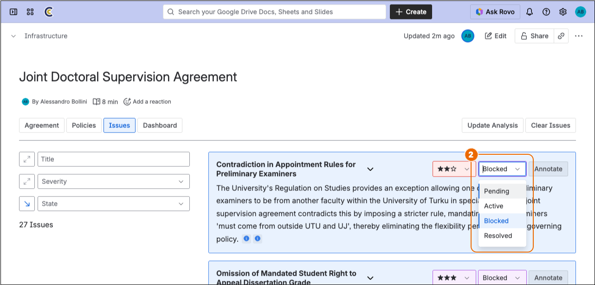

2. Click on the state selector in the issue header and choose the relevant state classification to override the
	 [value](#issues) automatically assigned by the system on creation

## Annotate Issue

1. [Inspect issues](#inspect-issues) and scroll to the relevant issue

	 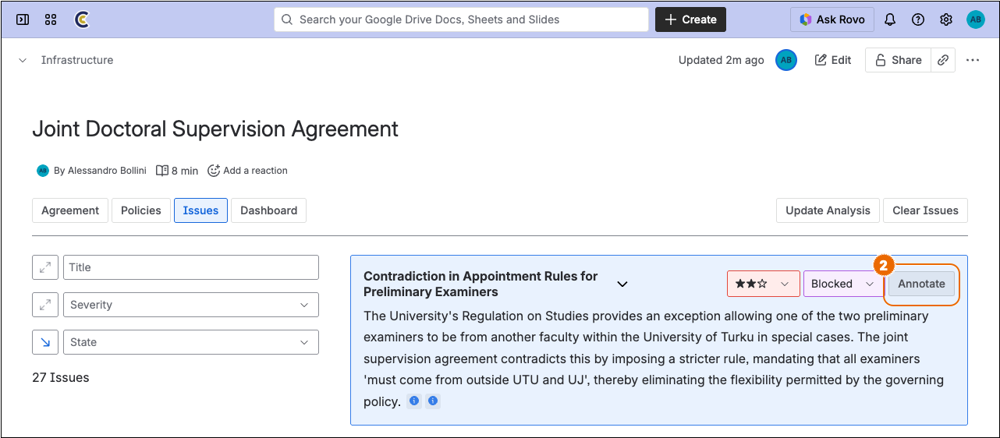

2. Click on the `Annotate` button in the issue header to enter annotation mode

	 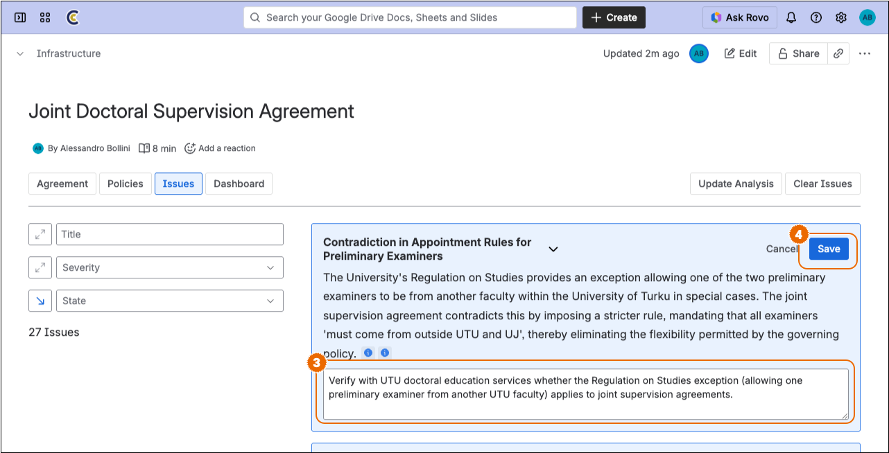

3. Enter or edit issue annotations

	 > [!TIP]
	 > Structured annotations may be entered using the basic [Markdown](https://www.markdownguide.org/basic-syntax/)
	 format.

4. Click on the `Save` button to save updated annotations

	- Click on the `Cancel` button to discard changes

> [!IMPORTANT]
> The system will take into account annotations when [updating agreement analysis](#update-analysis).

## Update Analysis

Agreement analysis may be refreshed at any time, especially after the agreement text is modified; the system will take
into account existing issues and focus only on changes.

This action is intended to refresh issues after **incremental updates** to the agreement text or attached policy
documents: existing issues and user annotations are taken into account in the process, in order to avoid duplications or
regressions. After **major updates** extensively altering either the structure or the content of the agreement text or
the attached policies you may want to [clear the issues](#clear-issues) and
[analyse](#analyse-agreement) the text from scratch.

1. [Inspect issues](#inspect-issues)

	 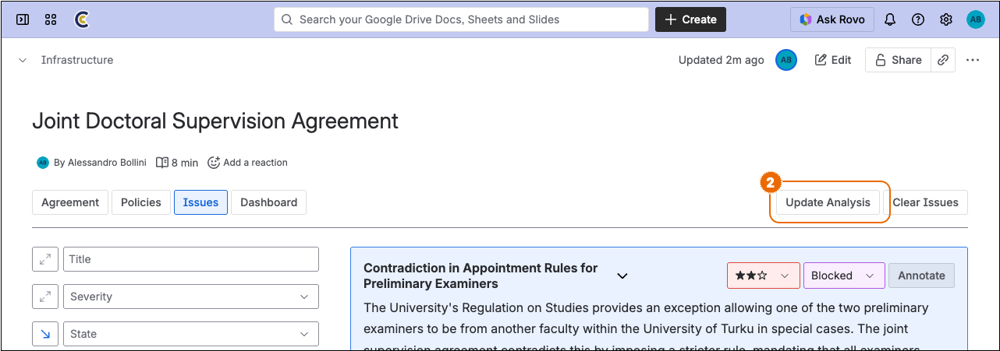

2. Click on the `Update Analysis` button in the toolbar

## Clear Issues

Clearing the issues drops the compliance analysis history of the page: the system will recompute results from scratch on
the next [analysis](#analyse-agreement).

1. [Inspect issues](#inspect-issues)

	 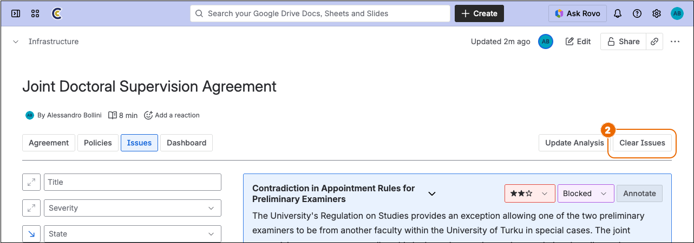

2. Click on the `Clear Issues` button in the toolbar

	 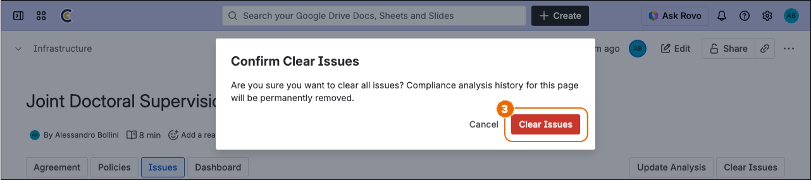

3. Click on the `Clear Issues` button to confirm the operation

# Dashboard

The dashboard view provides a dynamic issue matrix, suitable for status overview and process management:

- Columns represent issue [state](#issues) values: Pending, Active, Blocked, Resolved
- Rows represent issue [severity](#issues) values: ★★★ (High), ★★☆ (Medium), ★☆☆ (Low)
- Cells contain issues with the corresponding severity/state values

## Inspect Issue Matrix

1. [Open the target agreement](#open-agreement)

	 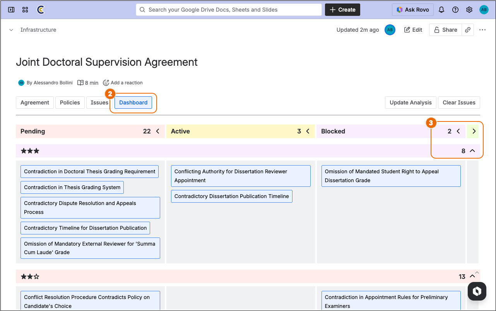

2. Click on the `Dashboard` tab to show the issue matrix

3. Click on column/row toggle buttons to collapse or expand related content

## Inspect Issue Details

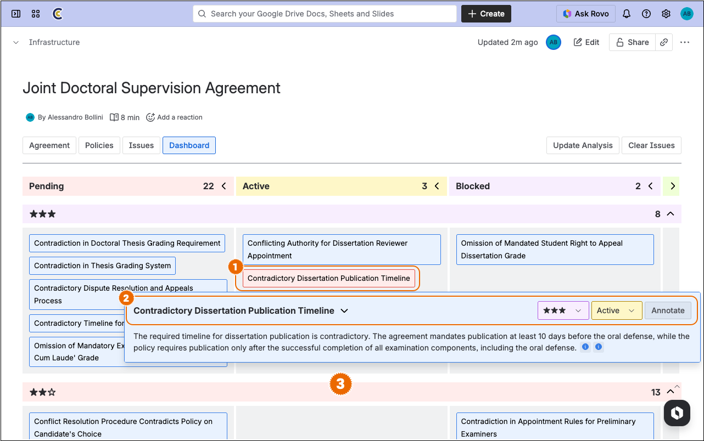

1. Click on an issue title to open its detail popup

2. Interact with the issue using the same tools described in the context of the [issue catalogue](#issues)

3. Click anywhere outside the popup to close it

> [!TIP]
> Updates to the issue [severity](#classify-issue) or [state](#transition-issue) will dynamically reposition it within
> the matrix.
